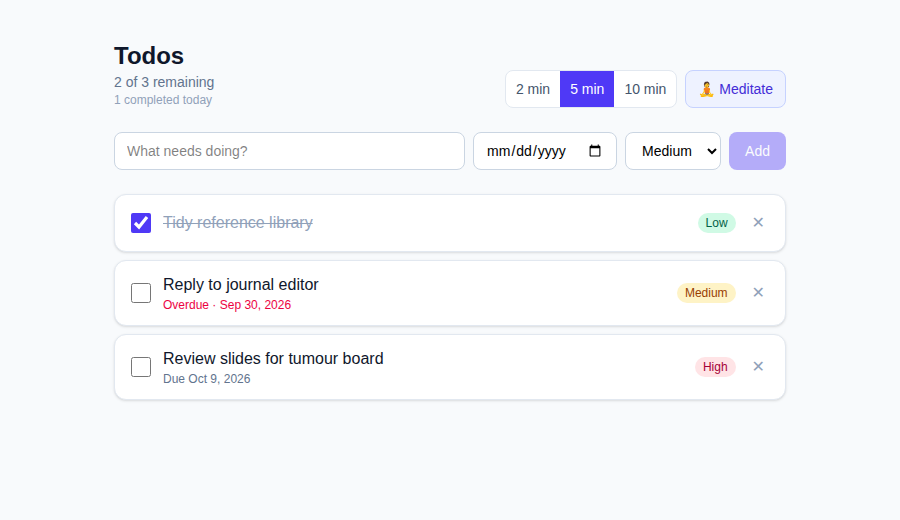
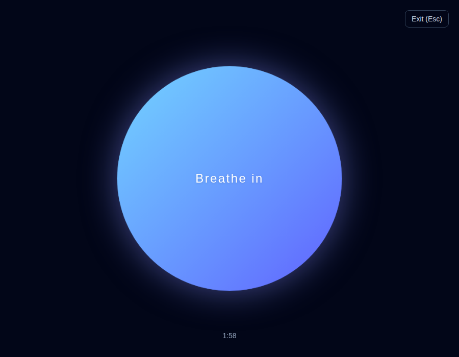

# Todo + Meditation

A small todo app with a built-in breathing exercise. Vite, React, TypeScript, Tailwind CSS. No backend, no auth; todos live in `localStorage`.



## Features

- Add, check off and delete todos. Each has a title, an optional due date and a priority (low, medium, high).
- Overdue dates are flagged on unfinished todos.
- A small "completed today" counter under the title counts todos checked off since midnight (local time). Unchecking or deleting a todo lowers it.
- Data persists in the browser under the `todos` key.
- **Meditation mode** hides the list and opens a full-screen breathing circle: 4 s expanding (breathe in), 6 s contracting (breathe out), repeated for the length you pick (2, 5 or 10 minutes; the choice is remembered). A countdown shows the time left. Press `Esc` or use the Exit button to leave early.



## Getting started

Requires Node 20+.

```bash
npm install
npm run dev      # http://localhost:5173
npm run build    # type-check and production build into dist/
npm run lint
```

## Structure

```
src/
  App.tsx                    state and layout
  types.ts                   Todo and Priority types
  hooks/useLocalStorage.ts   persisted state hook
  components/
    TodoForm.tsx
    TodoItem.tsx
    Meditation.tsx           timer and breathing animation
```

## Notes

- The breathing animation is a CSS transform transition whose duration switches between 4000 ms and 6000 ms. Phase is derived from elapsed time, so it stays in step with the clock rather than accumulating timer drift.
- Clearing site data removes your todos. There is no export or sync.
